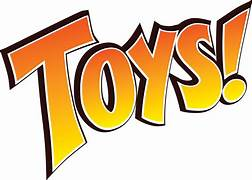

# Toys-Auto-Sales-Analysis-Dashboard
&nbsp;

## Overview : 
This dashboard provides a comprehensive analysis of toy auto sales using interactive visualizations and key performance metrics. It allows users to explore sales trends, customer behavior, and market performance using various filters.

## Tool used :
&nbsp;

## Result and Insights :
- Sales Performance: 2020 revenue is 42.82% of the target, indicating the need for stronger sales & marketing strategies.

- Best & Worst Products: Classic Cars & Vintage Cars drive the most sales, while Ships, Trains, and Planes underperform.

- Yearly Sales Trend: 2019 had the highest sales, but 2020 saw a major drop, requiring demand recovery strategies.

- Top & Low-performing Markets: USA, Switzerland, and Japan lead in sales, while France, Ireland, and Denmark need better outreach.

- Order Status & Fulfillment: Majority of orders are shipped, but cancellations & disputes highlight the need for better customer support.

- Customer Insights: A few top customers contribute most revenue, making loyalty programs & personalized offers crucial for retention.

## Additional Insights:
  - Seasonal Sales Trends: Sales peak in April and July, suggesting a need for seasonal marketing campaigns and inventory optimization.

  - Customer Concentration: A small group of top customers drives a large share of revenue—targeted offers can increase retention and lifetime value.

  - Revenue Diversification: Over-reliance on Classic Cars & Vintage Cars—expanding sales efforts for underperforming products could balance revenue streams.

  - Geographical Expansion: High sales in a few countries indicate a concentrated market—exploring new regions could unlock untapped opportunities.

  - Operational Efficiency: While most orders are shipped successfully, a small percentage of cancellations & disputes suggests a need for process improvements in logistics and customer service.

## Data Story :
The auto sales analysis uncovers key trends from 2,748 transactions, highlighting seasonal sales patterns, top-performing product lines like Motorcycles, and customer purchasing behaviors based on deal size and order frequency. Regional analysis identifies high-demand markets, while order status tracking helps optimize fulfillment efficiency. These insights enable data-driven decisions for inventory management, targeted marketing, and improved logistics, ultimately enhancing sales performance and customer satisfaction.

 
  ## Dashboard :
  &nbsp;
